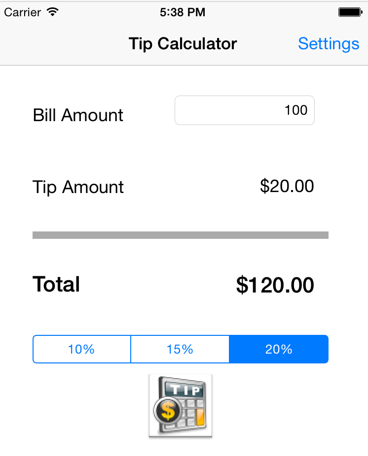

# iOS Tip Calculator

This is an iOS demo application to calculate tips.

Time spent: 3 hours spent in total

Completed user stories:

 * [x] Required: setup development environemnt, started reading about Objective-C.
 * [x] Required: followed the video walkthrough and implemented the basic tip calculator.
 * [x] Required: added the settings functionality to set default tip.
 * [x] Required: understood the view controller lifecycle.
 * [x] Optional: played around with Xcode and with the UI.
 

